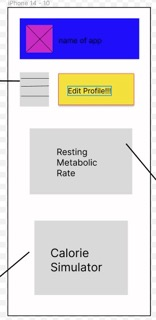
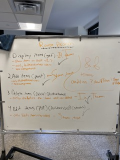

## Description

This application simulates looking at items on a shelf. A user can register to the app and sign in with their credentials. Once signed in a user can see items displayed on the shelf from all the users. This app also gives the user the ability to edit or delete one of their posts they've made

## Screenshots

## Built With

## Getting Started

Create a new database called auth_shelf and fill it with the sql from database.sql file

### Prerequisites

Node.js
PostrgeSQL
Nodemon

### Installation

Run npm install
npm run server
npm run client

## Acknowledgements

Who helped you make this project a reality? Friends? Family? Contributors? Instructors?

